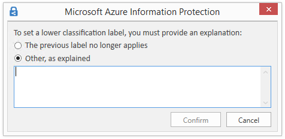

---
# required metadata

title: How to configure the global policy settings | Azure Information Protection
description: There are 3 settings in the Azure Information Protection policy that apply to all users, all devices.
author: cabailey
ms.author: cabailey
manager: mbaldwin
ms.date: 11/04/2016
ms.topic: article
ms.prod:
ms.service: information-protection
ms.technology: techgroup-identity
ms.assetid: 629815c0-457d-4697-a4cc-df0e6cc0c1a6

# optional metadata

#ROBOTS:
#audience:
#ms.devlang:
#ms.reviewer: eymanor
#ms.suite: ems
#ms.tgt_pltfrm:
#ms.custom:

---

# How to configure the global policy settings for Azure Information Protection

>*Applies to: Azure Information Protection*

There are 3 settings in the Azure Information Protection policy that apply to all users, all devices:

To configure these settings:

1. If you haven't already done so, in a new browser window, sign in to the [Azure portal](https://portal.azure.com) as a global admin, and then navigate to the **Azure Information Protection** blade. 
    
    For example, on the hub menu, click **More services** and start typing **Information** in the Filter box. Select **Azure Information Protection**.

2. On the **Azure Information Protection** blade, configure these global settings:

    - **All documents and emails must have a label**: When you set this option to **On**, all saved documents and sent emails must have a label applied. The labeling might be manually assigned by a user, automatically as a result of a [condition](configure-policy-classification.md), or be assigned by default (by setting the **Select the default label** option). 

    If a label is not assigned when a user saves a document or sends an email, they are prompted to select a label:

    

    - **Select the default label**: When you set this option, select the label to assign to documents and emails that do not have a label. You cannot set a label as the default if it has sub-labels. 

    - **Users must provide justification to set a lower classification label, remove a label, or remove protection**: When you set this option to **On** and a user does any of these actions (for example, change the **Secret** label to **Personal**), the user is prompted to provide an explanation for this action. For example, the user might explain that the document no longer contains sensitive information. The action and their justification reason is logged in their local Windows event log: **Application** > **Microsoft Azure Information Protection**.  

    

    This option is not applicable for sub-labels.

3. To save your changes, click **Save**.

4. To make your changes available to users, click **Publish**.

## Next steps

For more information about configuring your Azure Information Protection policy, use the links in the [Configuring your organization's policy](configure-policy.md#configuring-your-organizations-policy) section.  

