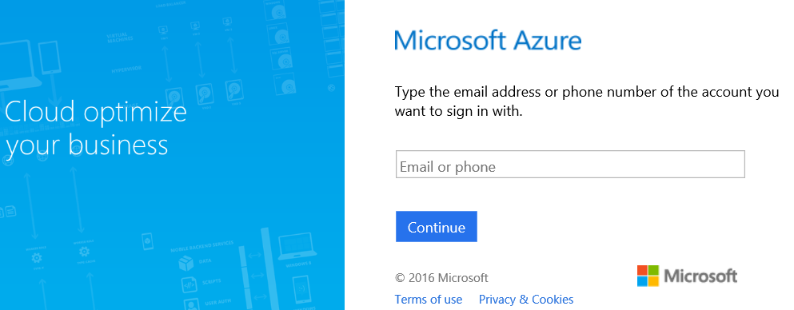
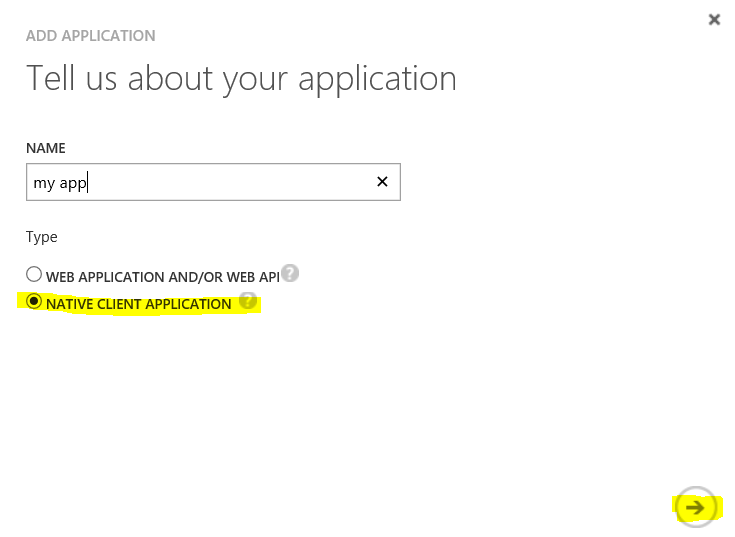
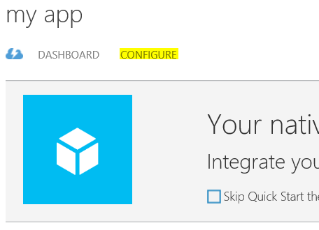

---
# required metadata

title: Configure Azure RMS for ADAL authentication | Azure RMS
description: Outlines the steps for configuring Azure ADAL based authentication
keywords: authentication, RMS, ADAL
author: bruceperlerms
manager: mbaldwin
ms.date: 04/28/2016
ms.topic: article
ms.prod: azure
ms.service: rights-management
ms.technology: techgroup-identity
ms.assetid: f89f59b7-33d1-4ab3-bb64-1e9bda269935

# optional metadata

#ROBOTS:
audience: developer
#ms.devlang:
ms.reviewer: shubhamp
ms.suite: ems
#ms.tgt_pltfrm:
#ms.custom:

---

# Configure Azure RMS for ADAL authentication

This topic describes the steps for configuring Azure ADAL based authentication.

## Azure Authentication setup

You will need the following:

- A [subscription for Microsoft Azure](https://azure.microsoft.com/en-us/) (a free trial is sufficient). For more information, see [How users sing up for RMS for individuals](../understand-explore/rms-for-individuals-user-sign-up.md)
- A subscription for Microsoft Azure Rights Management (a free [RMS for Individuals](https://technet.microsoft.com/en-us/library/dn592127.aspx) account is sufficient).

> [!NOTE] Ask your IT Admin whether or not you have a subscription for Microsoft Azure Rights Management and, have your IT Admin perform the steps below. If your organization does not have a subscription, you should have your IT admin create one. Also, your IT Admin should subscribe with a *Work or school account*, rather than a *Microsoft account* (i.e. Hotmail).

After signing up for Microsoft Azure:

- Login to the [Azure Management Portal](https://manage.windowsazure.com) for your organization using an account with administrative privileges.

- Browse down to the **Active Directory** application on the left side of the portal.

- If you haven’t created a directory already, choose the **New** button located in the bottom left corner of the portal.

- Select the **Rights Management** tab and ensure that the **Rights Management Status** is either **Active**, **Unknown** or **Unauthorized**. If the status is **Inactive**, choose the **Activate** button at the bottom, center portion of the portal and confirm your selection.

- Now, create a new *Native Application* in your directory by selecting your directory, choosing Applications.

- Then choose the **Add** button located in the bottom, center portion of the portal.

- At the prompt choose **Add an application my organization is developing**.

- Name your application by selecting **NATIVE CLIENT APPLICATION** and choosing the **Next** button.

- Add a redirection URI and choose next.
  The redirection URI needs to be a valid URI and unique to your directory. For example, you could use something like `com.mycompany.myapplication://authorize`.

- Select your application in the directory and choose **CONFIGURE**.

>[!NOTE] Copy the **CLIENT ID** and **REDIRECT URI** and store them for future use when configuring the RMS client.

- Browse to the bottom of your application settings and choose the **Add application** button under **permissions to other applications**.

>[!NOTE] The **Delegated Permissions** that are shown for Windows Azure Active Directory are correct by default – only one option should be selected and that option is **Sign in and read user profile**.

- Now, add this GUID `00000012-0000-0000-c000-000000000000` to the **STARTING WITH** edit box and choose the check button.

- Choose the plus button next to **Microsoft Rights Management**.

- Now, choose the check mark located on the bottom left corner of the dialog.

- You’re now ready to add a dependency to your application for Azure RMS. To add the dependency, select the new **Microsoft Rights Management Services** entry under **permissions to other applications** and choose the **Create and access protected content for users** checkbox under the **Delegated Permissions:** drop box.

- Save your application to persist the changes by choosing the **Save** icon located on the bottom, center of the portal.

