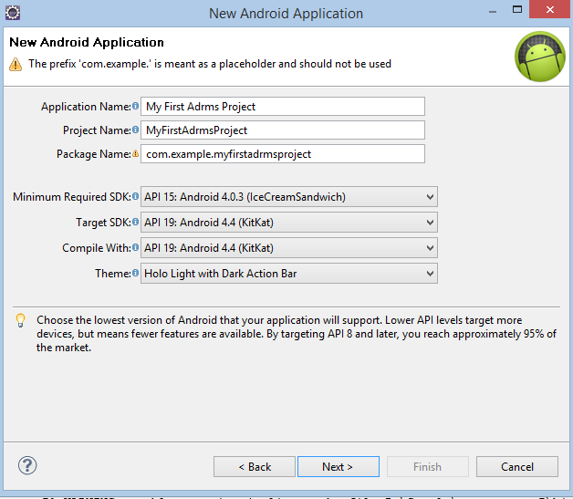
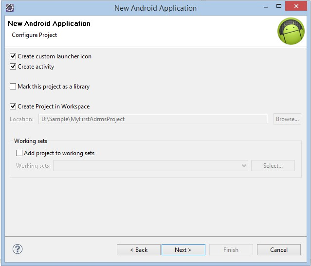
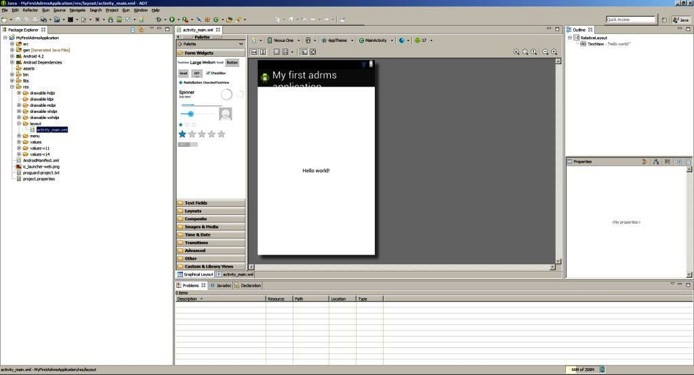
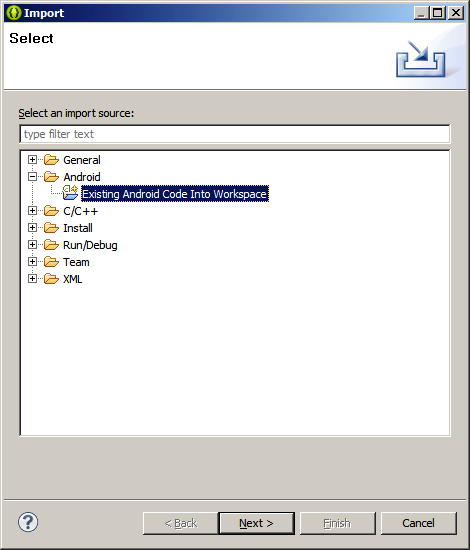
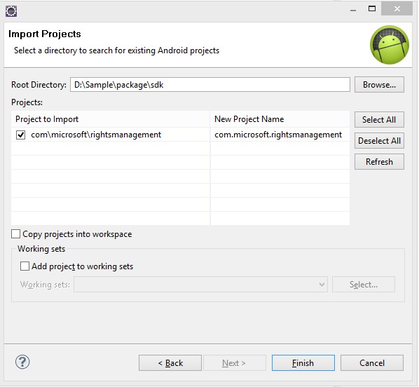
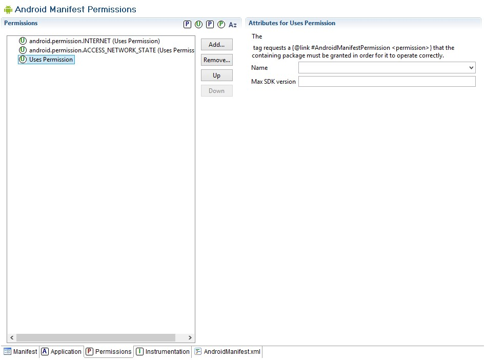

---
# required metadata

title: Android setup | Azure RMS
description: Android applications can use the Microsoft Rights Management SDK 4.2 to enable integrated information protection in their applications.
keywords:
author: bruceperlerms
manager: mbaldwin
ms.date: 04/28/2016
ms.topic: article
ms.prod: azure
ms.service: rights-management
ms.technology: techgroup-identity
ms.assetid: 986f6932-159b-4791-bd1a-7640a83ee792
# optional metadata

#ROBOTS:
audience: developer
#ms.devlang:
ms.reviewer: shubhamp
ms.suite: ems
#ms.tgt_pltfrm:
#ms.custom:

---

# Android setup

Android applications can use the Microsoft Rights Management SDK 4.2 to enable integrated information protection in their applications by using Azure Active Directory Rights Management (AAD RM ).

This topic will guide you through setting up your environment for creating your own new apps .

-   [Prerequisites](#prerequisites)
-   [Optional](#optional)
-   [Configuring your development environment](#configuring_your_development_environment_)
-   [See Also](#see_also)

## Prerequisites

We recommend the following software on your development system:

-   Windows or OS X operating system to run the [Eclipse](http://www.oracle.com/technetwork/java/javase/downloads/jre7-downloads-1880261.html) development environment.
-   This guide assumes that you are using the Eclipse SDK beginning with Eclipse Juno 4.2 and using a default installation.
-   Java starting with Java 1.6.
-   [Android Developer Tools (ADT) Plugin](http://developer.android.com/sdk/installing/index.html). NOTE - You might be asked to restart Eclipse to complete the installation.

     

-   The MS RMS SDK 4.2 package for Android. For more information see, [Get started](get-started.md).

    This SDK can be used to develop for Android 4.0.3 (API level 15) and later.

-   Authentication library: We recommend that you use the [Azure AD Authentication Library (ADAL)](https://msdn.microsoft.com/en-us/library/jj573266.aspx). However, other authentication libraries that support OAuth 2.0 can be used as well.

    For more information see, [ADAL for Android](https://github.com/MSOpenTech/azure-activedirectory-library-for-android)

    **Note**  If your application will not be using the ADAL Library as the OAuth 2.0 authentication library, you should review this Android guidance, [Some SecureRandom Thoughts](http://android-developers.blogspot.com/2013/08/some-securerandom-thoughts.html).

     

Read the [What's new](release-notes.md) topic for information about API updates, release notes, and frequently asked questions (FAQ).

## Optional

Our UI library provides re-usable UI for consumption and protection operations for developers who don’t want to create their own custom UI - [UI Library and Sample app for Android](https://github.com/AzureAD/rms-sdk-ui-for-android).

## Configuring your development environment

**Note**  MS RMS SDK 4.2 Preview Release: In this preview release, the screen shots have not been updated to show the change in name of the pathes from com/microsoft/protection to com/microsoft/rightsmanagment. The text though, has been updated.

 
-   Open the Eclipse development environment.
-   To create a new Android Application project, on the **File** menu, click **New**, click **Project**, and then select **Android Application Project**.

    

-   Enter the application name. The project name and package name is filled based on the application name.
-   Click **Next** and select where you want to create the workspace.

    

-   Click **Next** and select an icon for your app.

    

-   Click **Next** and select **Blank Activity** to create the activity.

    

-   Click **Next** and provide a name for the activity. You can leave *MainActivity* as the default name with a layout name of *activity\_main*.

    

-   Click **Finish**.

    

-   Your project has been created, along with the main activity class *MainActivity.java*.

**Referencing the SDK**

-   Navigate to the folder in which you extracted the *adrms\_android\_sdk.zip*. In the "SDK > com > microsoft > rightsmanagement" folder, make sure the files *.classpath*, *.project*, and *project.properties* are not marked as read-only.
-   To reference the SDK, you must import it to the workspace.

    In Eclipse, click **File**. On the **File** menu, click **Import**. In the **Import** dialog box, select **Android / Existing Android Code into Workspace**.

    

-   Click **Next**. Navigate to select the folder in which you extracted the *adrms\_android\_sdk.zip*. The SDK should appear in the list as **com.microsoft.rightsmanagement**.

    

-   When you click **Finish**, the SDK project appears as a sibling of your previously created application.

    

-   Right-click the **Project** icon and view the properties for the project.
-   Navigate to the **Android** tab.
-   Click **Add**, and then select the *com.microsoft.rightsmanagement* library from the workspace.

    

-   Click **OK**.

    Because the MS RMS SDK 4.2 connects with AAD RM, the application has to be granted the **INTERNET** and **ACCESS\_NETWORK\_STATE**. To do so, open the *AndroidManifest.xml* file in the root of the project.

    To add the permissions, click **Add**, and then select **Uses Permissions**.

    

-   You can verify the manifest step by viewing the manifest in the text editor view. Make sure the following lines appear:

    <uses-sdk
         android:minSdkVersion="15"
         android:targetSdkVersion="19"/>
    <uses-permission android:name="android.permission.INTERNET"/>
    <uses-permission android:name="android.permission.ACCESS_NETWORK_STATE"/>
    <uses-permission/>

**Note**  The SDK uses the *android.support.v4*

-   You are now ready to create your own new Android apps.

### See Also

[Get started](get-started.md)

[What's new](release-notes.md)

[Developer terms and concepts](core-concepts.md)

[Android API Reference](/rights-management/sdk/4.2/api/android/com.microsoft.rightsmanagement)

 

 
