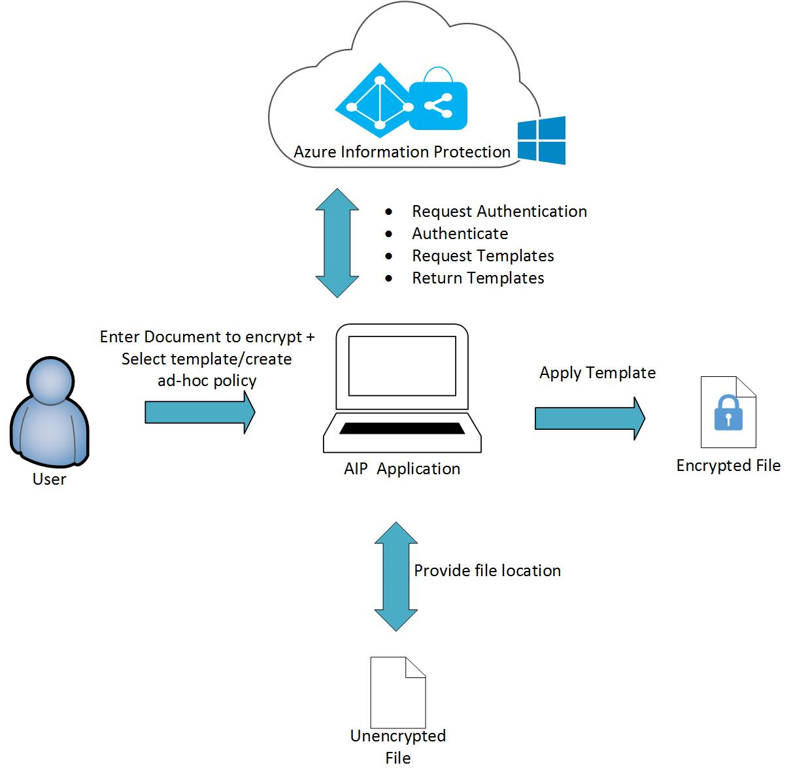
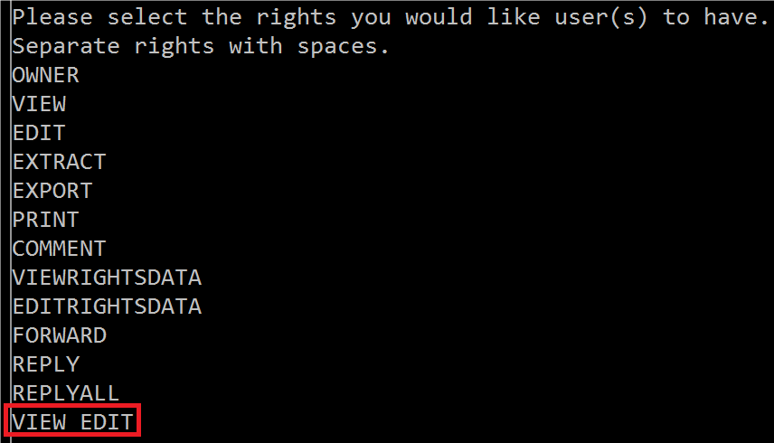

---
# required metadata

title: Developing your application | Azure Information Protection
description: Guidance thorugh a basic console app implementing document protection with AIP
keywords:
author: bruceperlerms
ms.author: bruceper
manager: mbaldwin
ms.date: 12/05/2016
ms.topic: article
ms.prod:
ms.service: information-protection
ms.technology: techgroup-identity
ms.assetid: 396A2C19-3A00-4E9A-9088-198A48B15289
# optional metadata

#ROBOTS:
audience: developer
#ms.devlang:
ms.reviewer: kartikk
ms.suite: ems
#ms.tgt_pltfrm:
#ms.custom:

---

# Developing your application

In this example you are going to build a simple console application that interacts with the Azure Information Protection service (AIP).  It will take as input the path of a document to protect, then protect it with an ad-hoc policy or an Azure template. The application will then apply the correct policies according to the inputs, creating a information protected document. The sample code you will be using is [Azure IP test application](https://github.com/Azure-Samples/Azure-Information-Protection-Samples/tree/master/AzureIP_Test) and is on Github.

## Sample app prerequisites
- **Operating System**: Windows 10, Windows 8, Windows 7, Windows Server 2008, Windows Server 2008 R2, or Windows Server 2012
- **Programming Language**: C# (.NET Framework 3.0 and above)
- **Development environment**: Visual Studio 2015 (and later)

## Setting up your Azure Configuration

Getting Azure set up for this app requires you to create a Tenant ID, a Symmetric Key, and an Application Principal ID.

### Azure AD Tenant configuration

To configure the Azure AD environment for Azure Information Protection, follow the guidance in [Activating Azure Rights Management](https://docs.microsoft.com/en-us/information-protection/deploy-use/activate-service).

Once the service is activated you will need PowerShell components for the next steps. Follow [Administering the Azure Rights Management service by using Windows PowerShell](https://docs.microsoft.com/en-us/information-protection/deploy-use/administer-powershell) to accomplish this.

### Getting your Tenant ID

- As an administrator, run PowerShell.
- Import the RMS module: `Import-Module AADRM`
- Connect to the service with the assigned user credentials: `Connect-AadrmService –Verbose`
- Ensure RMS is enabled: `Enable-AADRM`
- Get your tenant ID by running: `Get-AadrmConfiguration`

>Record the BPOSId (tenant ID) value. You will need it in future steps.

*Example output*

- Disconnect from the service: `Disconnect-AadrmService`

### Create a service Principal
Follow these steps to create a Service Principal:
> A service principal is credentials configured globally for access control that allow a service to authenticate with Microsoft Azure AD and to protect information using Microsoft Azure AD Rights Management

- As an administrator, run PowerShell
- Import the Microsoft Azure AD module using: `Import-Module MSOnline`
- Connect to your online service with the assigned user credentials: `Connect-MsolService`
- Create a new service principal by running: `New-MsolServicePrincipal`
- Provide a name for your service principal
> Record the symmetric key and application principal id for future use.

*Example output*

- Add your application principal id, symmetric key, and tenant ID to the application’s App.config file.

*Example App.config file*

## Design summary
The following diagram depicts an architecture and process flow for the app you're creating, steps outlined below.

1. The user inputs:
  - The path of the file to be protected
  - Selects a template or creates an ad-hoc policy
2. The application requests authentication with AIP.
3. AIP confirms authentication
4. The application requests templates from the AIP.
5. AIP returns pre-defined templates.
6. The application locates the specified file with given location.
7. The application applies the AIP protection policy to the file.

## How the code works

In the sample, Azure IP Test, the solution begins up with the file Iprotect.cs. This is a C# console application and, like with any other AIP enabled application, you begin with loading the *MSIPC.dll* as shown in the `main()` method.

    //Loads MSIPC.dll
    SafeNativeMethods.IpcInitialize();
    SafeNativeMethods.IpcSetAPIMode(APIMode.Server);

Load the parameters needed to connect to Azure

    //Loads credentials for the service principal from App.Config
    SymmetricKeyCredential symmetricKeyCred = new SymmetricKeyCredential();
    symmetricKeyCred.AppPrincipalId = ConfigurationManager.AppSettings["AppPrincipalId"];
    symmetricKeyCred.Base64Key = ConfigurationManager.AppSettings["Base64Key"];
    symmetricKeyCred.BposTenantId = ConfigurationManager.AppSettings["BposTenantId"];

When you provide the file path in the console application, the application checks if the document is already encrypted. The method is of the **SafeFileApiNativeMethods** class.

    var checkEncryptionStatus = SafeFileApiNativeMethods.IpcfIsFileEncrypted(filePath);

If the document is not encrypted, then it proceeds to encrypt the document with the selection provided on the prompt.

    if (!checkEncryptionStatus.ToString().ToLower().Contains(alreadyEncrypted))
    {
      if (method == EncryptionMethod1)
      {
        //Encrypt a file via AIP template
        ProtectWithTemplate(symmetricKeyCred, filePath);

      }
      else if (method == EncryptionMethod2)
      {
        //Encrypt a file using ad-hoc policy
        ProtectWithAdHocPolicy(symmetricKeyCred, filePath);
      }

The protect with template option proceeds to get the template list from the server and provides the user the option to select.
>If you did not Modify templates then you will get default templates from AIP

     public static void ProtectWithTemplate(SymmetricKeyCredential symmetricKeyCredential, string filePath)
     {
       // Gets the available templates for this tenant             
       Collection<TemplateInfo> templates = SafeNativeMethods.IpcGetTemplateList(null, false, true,
           false, true, null, null, symmetricKeyCredential);

       //Requests tenant template to use for encryption
       Console.WriteLine("Please select the template you would like to use to encrypt the file.");

       //Outputs templates available for selection
       int counter = 0;
       for (int i = 0; i < templates.Count; i++)
       {
         counter++;
         Console.WriteLine(counter + ". " + templates.ElementAt(i).Name + "\n" +
             templates.ElementAt(i).Description);
       }

       //Parses template selection
       string input = Console.ReadLine();
       int templateSelection;
       bool parseResult = Int32.TryParse(input, out templateSelection);

       //Returns error if no template selection is entered
       if (parseResult)
       {
         //Ensures template value entered is valid
         if (0 < templateSelection && templateSelection <= counter)
         {
           templateSelection -= templateSelection;

           // Encrypts the file using the selected template             
           TemplateInfo selectedTemplateInfo = templates.ElementAt(templateSelection);

           string encryptedFilePath = SafeFileApiNativeMethods.IpcfEncryptFile(filePath,
               selectedTemplateInfo.TemplateId,
               SafeFileApiNativeMethods.EncryptFlags.IPCF_EF_FLAG_KEY_NO_PERSIST, true, false, true, null,
               symmetricKeyCredential);
          }
        }
      }

If you select ad-hoc policy, the user of the application has to provide emails of the people that would have rights. In this section the license is created using the **IpcCreateLicenseFromScratch()** method and applying the new policy on the template.

    if (issuerDisplayName.Trim() != "")
    {
      // Gets the available issuers of rights policy templates.              
      // The available issuers is a list of RMS servers that this user has already contacted.
      try
      {
        Collection<TemplateIssuer> templateIssuers = SafeNativeMethods.IpcGetTemplateIssuerList(
                                                        null,
                                                        true,
                                                        false,
                                                        false, true, null, symmetricKeyCredential);

        // Creates the policy and associates the chosen user rights with it             
        SafeInformationProtectionLicenseHandle handle = SafeNativeMethods.IpcCreateLicenseFromScratch(
                                                            templateIssuers.ElementAt(0));
        SafeNativeMethods.IpcSetLicenseOwner(handle, owner);
        SafeNativeMethods.IpcSetLicenseUserRightsList(handle, userRights);
        SafeNativeMethods.IpcSetLicenseDescriptor(handle, new TemplateInfo(null, CultureInfo.CurrentCulture,
                                                                policyName,
                                                                policyDescription,
                                                                issuerDisplayName,
                                                                false));

        //Encrypts the file using the ad hoc policy             
        string encryptedFilePath = SafeFileApiNativeMethods.IpcfEncryptFile(
                                       filePath,
                                       handle,
                                       SafeFileApiNativeMethods.EncryptFlags.IPCF_EF_FLAG_KEY_NO_PERSIST,
                                       true,
                                       false,
                                       true,
                                       null,
                                       symmetricKeyCredential);
       }
    }

## User interaction example

Once you get everything built and executing, the outputs of the application should look like the following:

1.You are prompted to select an encryption method.

2. You are asked to provide the path to the file to be protected.

3. You are prompted to enter a license owner’s email (this owner must have Global Administrator privileges on the Azure AD Tenant).

4. You enter email addresses of users who will have rights to access the file (emails must be separated by spaces).

5. You select from a list of rights to be given to the authorized users.

6. Finally, you enter some policy metadata: policy name, description, and issuer (Azure AD Tenant) display name

