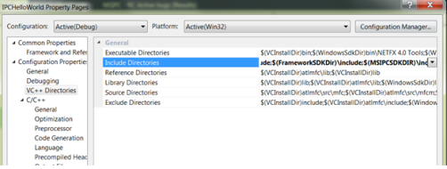
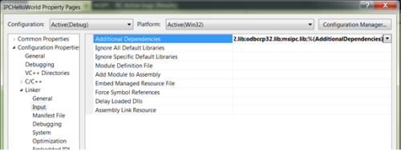
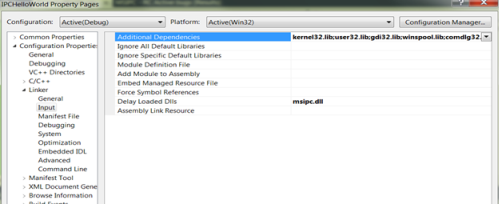
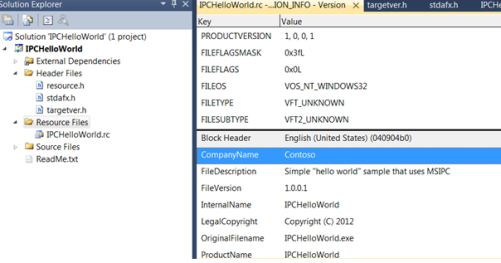

---
# required metadata

title: Configure Visual Studio | Azure RMS
description: Instructions about how to configure a Visual Studio project to use the RMS SDK 2.1.
keywords:
author: lleonard-msft
ms.author: alleonar
manager: mbaldwin
ms.date: 02/23/2017
ms.topic: article
ms.prod:
ms.service: information-protection
ms.assetid: 396A2C19-3A00-4E9A-9088-198A48B15289
# optional metadata

#ROBOTS:
audience: developer
#ms.devlang:
ms.reviewer: shubhamp
ms.suite: ems
#ms.tgt_pltfrm:
#ms.custom:

---

# Configure Visual Studio

This topic contains instructions about how to configure a Visual Studio project to use the Rights Management Services SDK 2.1.

## Prerequisites

-   [Install the SDK](install-the-rms-sdk.md)

**Instructions**

### Step 1: Configure a Visual Studio project to use RMS SDK 2.1

These instructions are specific to Microsoft Visual Studio 2010. If you are using a different version of Microsoft Visual Studio, your settings dialog boxes may appear slightly different.

These instructions apply to building a native 32-bit application.

1.  Add the RMS SDK 2.1 include directory to your Visual Studio 2010 project.

    Under **Configuration Properties** select **VC++ Directories** and add the RMS SDK 2.1 include directory, **$(MSIPCSDKDIR)\\inc**, to the **Include Directories** field.

    

2.  Add the RMS SDK 2.1 library directory to your Visual Studio 2010 project.

    Under **Configuration Properties** select **VC++ Directories** and add the RMS SDK 2.1 library directory, to the **Library Directories** field for your platform.

    -   For Win32, use **$(MSIPCSDKDIR)\\lib**
    -   For x64, use **$(MSIPCSDKDIR)\\lib\\x64**

    

3.  Add the RMS SDK 2.1 library files as Visual Studio 2010 dependencies.

    Under **Linker**, select **Input** and add the RMS SDK 2.1 library files; **Msipc.lib** and **Msipc\_s.lib**, to the **Additional Dependencies** field.

    

4.  Add the RMS SDK 2.1 Dynamic Link Library (DLL) as a delay-loaded DLL.

    Under **Linker**, select **Input**, and add the RMS SDK 2.1 DLL file, **Msipc.dll**, to the **Delay Loaded Dlls** field.

    

5.  Create version information for your resulting binary.

    Under **Solution Explorer** select **Resource Files** and add your binary name to the **OriginalFileName** field.

    

## Related topics

* [Install the SDK](install-the-rms-sdk.md)
