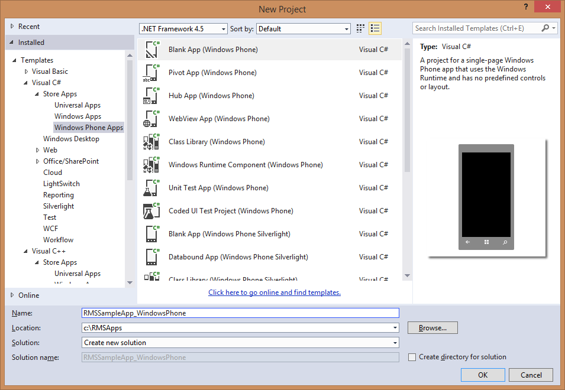
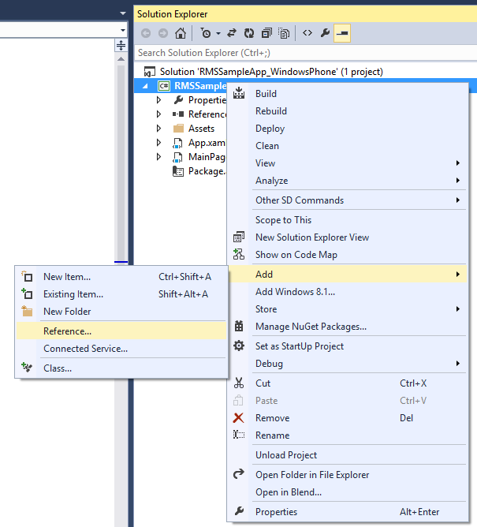

---
# required metadata

title: Windows Phone setup | Azure RMS
description:
keywords:
author: bruceperlerms
manager: mbaldwin
ms.date: 04/28/2016
ms.topic: article
ms.prod: azure
ms.service: rights-management
ms.technology: techgroup-identity
ms.assetid: 71119aa7-ffc6-46e0-82ae-0b3b614c2cad

# optional metadata

#ROBOTS:
audience: developer
#ms.devlang:
ms.reviewer: shubhamp
ms.suite: ems
#ms.tgt_pltfrm:
#ms.custom:

---

# Windows Phone setup

Windows Phone applications can use the Microsoft Rights Management SDK 4.2 to enable integrated information protection in their application by using the Azure Active Directory Rights Management (AAD RM).

This topic will guide you through setting up your environment for creating your own new apps .

-   [Prerequisites](#prerequisites)
-   [Configuring your development environment](#configuring_your_development_environment)
-   [See Also](#see_also)

## Prerequisites

You must have the following software on your development system:

-   The [Windows 8.1](http://windows.microsoft.com/en-US/windows-8/meet) operating system.
-   [Windows Phone 8.1 Development Tools (SDK)](http://dev.windowsphone.com/en-us/downloadsdk)
-   Microsoft [Visual Studio 2012](http://www.microsoft.com/visualstudio/eng/products/visual-studio-overview)or above, or Visual Studio Express 2012, which is included in the Windows Phone SDK 8.0/8.1
-   The MS RMS SDK 4.2 package for Windows Phone. For more information see, [Get started](get-started.md).
-   Authentication library: We recommend that you use the [Azure AD Authentication Library](https://msdn.microsoft.com/en-us/library/jj573266.aspx) and other authentication libraries can be used.

Read the [What's new](release-notes.md) topic for information on API updates, device and environment information, release notes and frequently asked questions (FAQ).

Review the information in the [Windows Phone development](https://msdn.microsoft.com/en-us/library/windowsphone/develop/ff402535.aspx) guide at the Windows Phone Dev Center.

## Configuring your development environment

-   Open *Visual Studio*.
-   Click **File**. On the **File** menu, click **New**, and then click **Project**.
-   In the **New Project** dialog box, select **Visual C\#**, select **Blank App (Windows Phone)**, and then click **OK**.

    

-   In Solution Explorer, right-click your project, and then select **Add Reference** to open the **Add Reference** dialog box.

    

-   Click **Browse** on the lower left of the **Add Reference** dialog box and select the *Microsoft.RightsManagment.dll* file that is located in the folder you extracted the package in.
-   **Managed Apps** - For building a managed app, you will have to add this reference; select **Windows 8.1**-&gt;**Extensions** and check the box for **Windows Visual C++ Runtime Package for Windows**

    

-   **Adding Capabilities** - Your application will need the "Internet (Client & Server)" capability to use the SDK. To add this capability to your app, open the *Package.appxmanifest* file in the project and navigate to the **Capabilities** tab to add.

You are now ready to create your own new Windows Phone apps.

### See Also

[Get started](get-started.md)

[What's new](release-notes.md)

[Core concepts](core-concepts.md)

[Windows Phone development](https://msdn.microsoft.com/en-us/library/windowsphone/develop/ff402535.aspx)

[Windows API Reference](/rights-management/sdk/4.2/api/winrt/Microsoft.RightsManagement)

[Visual Studio 2012](http://www.microsoft.com/visualstudio/eng/products/visual-studio-overview)

[Windows Phone SDK](http://dev.windowsphone.com/en-us/downloadsdk)

 

 

