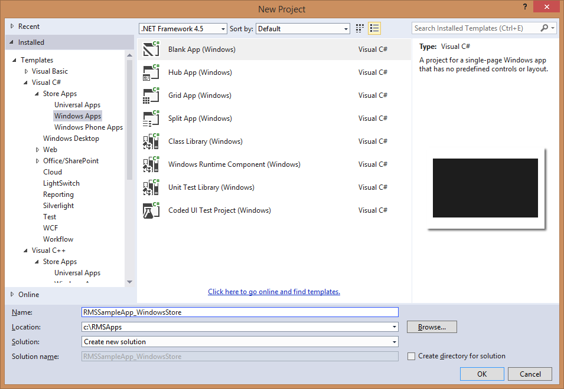
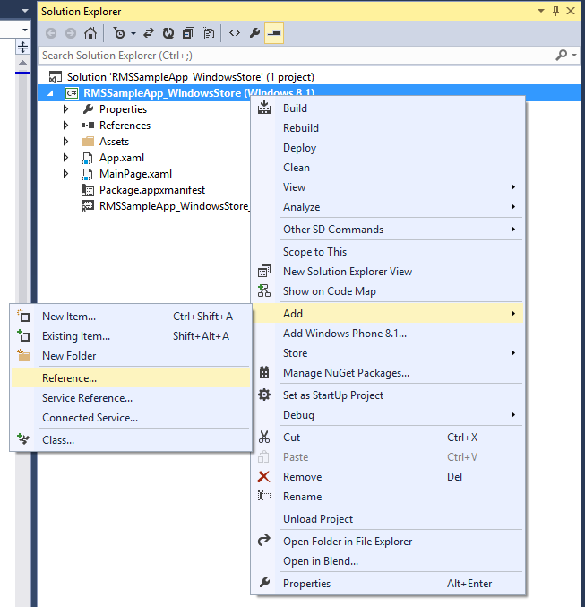

---
# required metadata

title: Windows Store setup | Azure RMS
description: Windows Store applications can use the Microsoft Rights Management SDK 4.2 to enable integrated information protection in their application.
keywords:
author: lleonard-msft
ms.author: alleonar
manager: mbaldwin
ms.date: 02/23/2017
ms.topic: conceptual
ms.service: information-protection
ms.assetid: 2720aa0e-0d37-469f-be99-678bf95a9c51
# optional metadata

#ROBOTS:
audience: developer
#ms.devlang:
ms.reviewer: shubhamp
ms.suite: ems
#ms.tgt_pltfrm:
#ms.custom:

---

# Windows Store setup

Windows Store applications can use the Microsoft Rights Management SDK 4.2 to enable integrated information protection in their application by using the Azure Active Directory Rights Management (AAD RM).

This topic will guide you through setting up your environment for creating your own new apps.

-   [Prerequisites](#prerequisites)
-   [Optional](#optional)
-   [Configuring your development environment](#configuring-your-development-environment)
-   [See Also](#see-also)

## Prerequisites

You must have the following software on your development system:

-   The [Windows 8.1](http://windows.microsoft.com/en-US/windows-8/meet) operating system
-   The [Windows SDK for Windows 8.1](https://msdn.microsoft.com/windows/desktop/bg162891.aspx)
-   Microsoft [Visual Studio 2012](http://www.microsoft.com/visualstudio/eng/products/visual-studio-overview) or above, or Visual Studio Express 2012, which is included in the Windows SDK for Windows 8.0/8.1.
-   The MS RMS SDK 4.2 package for Windows Store Applications. For more information see, [Get started](get-started.md).
-   Authentication library: We recommend that you use the [Azure AD Authentication Library](https://msdn.microsoft.com/library/jj573266.aspx) and other authentication libraries can be used.

Read the [What's new](release-notes.md) topic for information on API updates, device and environment information, release notes and frequently asked questions (FAQ).

## Optional

Our UI library provides re-usable UI for consumption and protection operations for developers who don’t want to create their own custom UI - [UI Library for Windows Store apps](https://github.com/AzureAD/rms-sdk-ui-for-windowsstore). We also provide a Windows Store app sample application - [RMS Sample application for Windows Store](https://github.com/AzureADSamples/rms-samples-for-windowsstore).

## Configuring your development environment

-   Open Visual Studio.
-   Click **File**, click **New**, and then click **Project**.
-   In the **New Project** dialog box, click **Visual C\#** and select **Blank App (Windows)** then click **OK**.

    

-   In **Solution Explorer**, right-click your project, and select **Add Reference** to open the **Add Reference** dialog box.

    

-   In the **Add Reference** dialog box, click **Browse** and select the *Microsoft.RightsManagement.dll* file that is located in the folder you extracted the SDK package in.
-   **Managed Apps** - For building a managed app, you will have to add this reference; select **Windows 8.1**-&gt;**Extensions** and check the box for **Windows Visual C++ Runtime Package for Windows**

    

-   **Adding Capabilities** - Your application will need "Internet (Client & Server)" capability to use the SDK. To add this capability to your app, open the *Package.appxmanifest* file in the project and navigate to the **Capabilities** tab to add.

You are now ready to create your own new Windows Store apps.

### See Also

[Get started](get-started.md)

[What's new](release-notes.md)

[Developer terms and concepts](core-concepts.md)

[Windows 8](http://windows.microsoft.com/en-US/windows-8/meet)

[Visual Studio 2012](http://www.microsoft.com/visualstudio/eng/products/visual-studio-overview)

[Windows API Reference](https://msdn.microsoft.com/library/dn891914.aspx)
