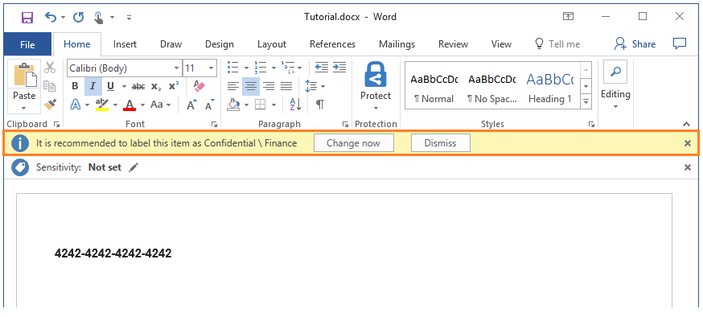

---
# required metadata

title: Quick start tutorial step 4  - AIP
description: Step 4 of an introduction tutorial to quickly try out Azure Information Protection - See labeling & protection in action.
author: cabailey
ms.author: cabailey
manager: mbaldwin
ms.date: 07/19/2017
ms.topic: article
ms.prod:
ms.service: information-protection
ms.technology: techgroup-identity
ms.assetid: 468748c1-49d6-4c3e-a612-9c584acdc782

# optional metadata

#ROBOTS:
#audience:
#ms.devlang:
#ms.reviewer: eymanor
#ms.suite: ems
#ms.tgt_pltfrm:
#ms.custom:

---

# Step 4: See classification, labeling, and protection in action 

>*Applies to: Azure Information Protection*

Now that you've got a Word document open with the Azure Information Protection client installed, you're ready to see how easy it is to start labeling and protecting your document, using the policy that we configured.

Classification and protection happen when you save the document, but before we do that, we'll use our unsaved document to see how easy it is to apply and change labels.

## To manually change our default label

On the Information Protection bar, select the last label and you see how sub-labels display:

Select one of these sub-labels, and you see how the other labels no longer display on the bar now that you've selected a label for this document. The **Sensitivity** value changes to show the label and sub-label name, with a corresponding change in label color. For example:

On the Information Protection bar, click the **Edit Label** icon next to the currently selected label value:

This displays the available labels again.

Now select the first label, **Personal**. Because you have selected a label that's a lower classification than the previously selected label for this document, you are prompted to justify why you are lowering the classification level:

Select **The previous label no longer applies**, and click **Confirm**. The **Sensitivity** value changes to **Personal** and the other labels are hidden again.

## To remove the classification completely

On the Information Protection bar, click the **Edit Label** icon again. But instead of choosing one of the labels, click the **Delete Label** icon:

This time when you are prompted, type "This document doesn't need classifying" and click **Confirm**.  

You see the **Sensitivity** value display **Not set**, which is what users see initially if you don't set a default label.

## To see a recommendation prompt for labeling and automatic protection

1. In the Word document, type a valid credit card number, for example: **4242-4242-4242-4242**. 

2. Save the document (use any file name, any location). 

3. You now see a prompt to apply the label that you configured for protection when credit card numbers are detected. If we didn't agree with the recommendation, our policy setting lets us reject it, by selecting **Dismiss**. Giving a recommendation but letting a user override it helps to reduce false positives when you're using automatic classification. For this tutorial, click **Change now**.

    

    In addition to the document now showing that our configured label is applied (for example, **Confidential \ Finance**), you immediately see the watermark of your organization name across the page, and the footer of **Classified as Confidential** is also applied. 

    The document is also protected with the permissions that you specified for this label. You can confirm that the document is protected by clicking the **File** tab and view the information for **Protect Document**. You see that the document is protected by **Confidential \ Finance** and the label description. Because of the protection configuration of the label, only employees can open the document and some actions are restricted for them. For example, because they do not have the Print and the Copy and extract content permissions, they cannot print the document or copy from it. Such restrictions help to prevent data loss. As the owner of the document, you can print it and copy from it, but if you email the document to another user in your organization, they cannot do these actions.

4. You can now close this document.

Now that you've seen classification, labeling, and protection in action, let's see how you can protect your documents even when they are shared with others in another organization. You can even track how they are being used and revoke access to them.

|If you want more information|Additional information|
|--------------------------------|--------------------------|
|Full instructions for labeling and protecting files |[Classify and protect a file or email](../rms-client/client-classify-protect.md)|
|Where the labeling activity is logging |[Usage logging for the Azure Information Protection client](../rms-client/client-admin-guide-files-and-logging.md#usage-logging-for-the-azure-information-protection-client)|

>[!div class="step-by-step"]
[&#171; Step 3](infoprotect-tutorial-step3.md)
[Step 5 &#187;](infoprotect-tutorial-step5.md)

[!INCLUDE[Commenting house rules](../includes/houserules.md)]