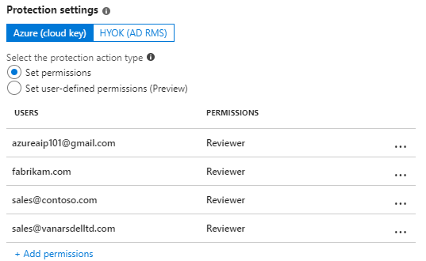
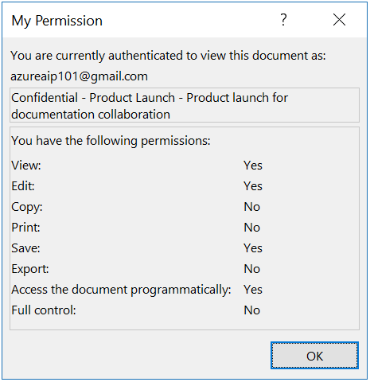
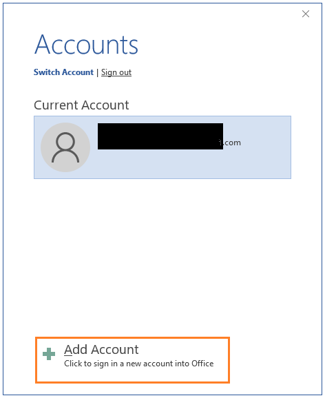
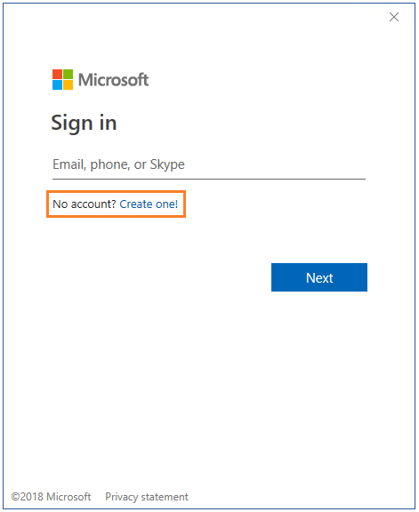

---
# required metadata

title: Secure document collaboration using Azure Information Protection
description: End-to-end workflow for collaborating on documents that are protected by Azure Information Protection.
author: cabailey
ms.author: cabailey
manager: mbaldwin
ms.date: 05/13/2018
ms.topic: get-started-article
ms.prod:
ms.service: information-protection
ms.technology: techgroup-identity
ms.assetid: 4895c429-959f-47c7-9007-b8f032f6df6f

# optional metadata

#ROBOTS:
#audience:
#ms.devlang:
ms.reviewer: esaggese
ms.suite: ems
#ms.tgt_pltfrm:
#ms.custom:

---

# Secure document collaboration by using Azure Information Protection

>*Applies to: [Azure Information Protection](https://azure.microsoft.com/pricing/details/information-protection), [Office 365](http://download.microsoft.com/download/E/C/F/ECF42E71-4EC0-48FF-AA00-577AC14D5B5C/Azure_Information_Protection_licensing_datasheet_EN-US.pdf)*

When you use Azure Information Protection, you can protect your documents without sacrificing collaboration for authorized users. The majority of documents that one user creates and then shares with others to view and edit will be Office documents from Word, Excel, and PowerPoint. These documents support native protection, which means that in addition to the protection features of authorization and encryption, they also support restricted permission for more fine-grained control. 

These permissions are called usage rights, and include permissions such as view, edit, print. You can define individual usage rights when a document is protected, or you can define a grouping of usage rights, called permission levels. Permission levels make it easier to select usage rights that are typically used together, for example, Reviewer and Co-Author. For more information about usage rights and permission levels, see [Configuring usage rights for Azure Rights Management](../deploy-use/configure-usage-rights.md).

When you configure these permissions, you also specify which users they are for:

- **For users in your own organization or another organization that uses Azure Active Directory**: You can specify Azure AD user accounts, Azure AD groups, or all users in that organization. 

- **For users who do not have an Azure Active Directory account**: Specify an email address that will be used with a Microsoft account. This account can already exist, or users can create it at the time they open the protected document. 
    
    To open documents with a Microsoft account, users must use Office 2016 Click-to-Run. Other Office editions and versions do not yet support opening Office protected documents with a Microsoft account.

As an administrator, you can configure an Azure Information Protection label to apply the permissions and authorized users. This configuration makes it very easy for users and other administrators to apply the correct protection settings, because they simply apply the label without having to specify any details. The following sections provide an example walkthrough to protect a document that supports secure collaboration with internal and external users.

## Example configuration for a label to apply protection to support internal and external collaboration

This example walks through configuring an existing label to apply protection so that users from your organization can collaborate on documents with all users from another organization that has Office 365 or Azure AD, a group from a different organization that has Office 365 or Azure AD, and a user who doesn't have an account in Azure AD and instead will use their Gmail email address. 

1. Select your label that's already in the global policy or a scoped policy. On the **Protection** blade, make sure that **Azure (cloud key)** is selected.
    
2. Make sure **Set permissions** is selected, and select **Add permissions**.

3. On the **Add permissions** blade: 
    
    - For your internal group: Select **Browse directory** to select the group, which must be email-enabled.
    
    - For all users in the first external organization: Select **Enter details** and type the name of a domain in the organization's tenant. For example, fabrikam.com.
    
    - For the group in the second external organization: Still on the **Enter details** tab, type the email address of the group in the organization's tenant. For example, sales@contoso.com.
    
    - For the user who doesn't have an Azure AD account: Still on the **Enter details** tab, type the user's email address. For example, bengi.turan@gmail.com. 

4. To grant the same permissions to all these users: For **Choose permissions from preset**, select **Co-Owner**, **Co-Author**, **Reviewer**, or **Custom** to select the permissions that you want to grant.
    
    For example, your configured permissions might look similar to the following:
        
    

5. Click **OK** on the **Add permissions** blade.

6. On the **Protection** blade, click **OK**. 

## Applying the label that supports secure collaboration

Now that this label is configured, it can be applied to documents in a number of ways that include the following:

|Different ways to apply the label|More information|
|---------------|----------|
|A user manually selects the label when the document is created in their Office application.|Users select the label from the **Protect** button on the Office ribbon, or from the Azure Information Protection bar.|
|Users are prompted to select a label when a new document is saved.|You've configured the Azure Information Protection [policy setting](../deploy-use/configure-policy-settings.md) named **All documents and emails must have a label**.|
|A user shares the document by email and manually selects the label in Outlook.|Users select the label from the **Protect** button on the Office ribbon, or from the Azure Information Protection bar, and the attached document is automatically protected with the same settings.|
|An administrator applies the label to the document by using PowerShell.|Use the [Set-AIPFile​Label](/powershell/module/azureinformationprotection/set-aipfilelabel) cmdlet to apply the label to a specific document or all documents in a folder.|
|You have additionally configured the label to apply automatic classification that can now be applied by using the Azure Information Protection scanner, or PowerShell.|See [How to configure conditions for automatic and recommended classification for Azure Information Protection](../deploy-use/configure-policy-classification.md).|

To complete this walkthrough, manually apply the label when you create the document in your Office application: 

1. On a client computer, if you already have your Office application open, first close and reopen it to get the latest policy changes that include your newly configured label. 

2. Apply the label to a document, and save it.

Share the protected document by attaching it to an email, and send it to the people you authorized to edit the document.

## Opening and editing the protected document

When users that you authorized open the document for editing, the document opens with an information banner that informs them that permissions are restricted. For example:

If they select the **View Permission** button, they see the permissions that they have. For example:

Before the document opens, one of the following authentication flows happen:

- For the users who have an Azure AD account, they use their Azure AD credentials to be authenticated by Azure AD, and the document opens. 

- For the user who doesn't have an Azure AD account, if they are not signed in to Office with an account that has permissions to open the document, they see the **Accounts** page. 
    
   On the **Accounts** page, select **Add Account**:
   
    

   On the **Sign in** page, select **Create one!** and follow the prompts to create a new Microsoft account with the email address that was used to grant the permissions:
    
    
    
    When the new Microsoft account is created, the local account switches to this new Microsoft account and the user can then open the document.

### Supported scenarios for opening protected documents

The following table summaries the different authentication methods that are supported for opening protected documents.

In addition, the Azure Information Protection viewer for iOS and Android can open files by using a Microsoft account.

|Platforms for editing documents:  Word, Excel, PowerPoint|Authentication method: Azure AD|Authentication method: Microsoft account|
|---------------|----------|-----------|-----------|
|Windows|Yes [[1]](#footnote-1)|Yes [[2]](#footnote-2)|
|iOS|Yes [[1]](#footnote-1)|No|
|Android|Yes [[1]](#footnote-1)|No |
|MacOS|Yes [[1]](#footnote-1)|No|

###### Footnote 1
Supports user accounts, email-enabled groups, all members. User accounts and email-enabled groups can include guest accounts. All members exclude guest accounts.

###### Footnote 2
Currently supported by Office 2016 Click-to-Run only.

## Next steps

For more information about the options and settings that you can configure for your label, see [Configuring Azure Information Protection policy](../deploy-use/configure-policy.md). This article includes some other [example configurations](../deploy-use/configure-policy.md#example-configurations) for configuring labels to apply protection for common scenarios.

This label configuration also creates a protection template by the same name. If you have applications and services that integrate with protection templates from Azure Information Protection, they can apply this template. For example, DLP solutions and mail flow rules. Outlook on the web automatically displays protection templates from the Azure Information Protection global policy. 

[!INCLUDE[Commenting house rules](../includes/houserules.md)]

