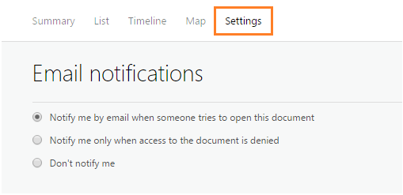

---
# required metadata

title: Track & revoke documents - Azure Information Protection
description: After you have protected your documents, you can track how people are using them. If necessary, you can also revoke access to these documents if people should no longer be able to read them. 
author: cabailey
ms.author: cabailey
manager: mbaldwin
ms.date: 06/28/2018
ms.topic: article
ms.prod:
ms.service: information-protection
ms.assetid: 643c762e-23ca-4b02-bc39-4e3eeb657a1d

# optional metadata

#ROBOTS:
#audience:
#ms.devlang:
ms.reviewer: esaggese
ms.suite: ems
#ms.tgt_pltfrm:
#ms.custom:

---

# User Guide: Track and revoke your documents when you use Azure Information Protection

>*Applies to: [Azure Information Protection](https://azure.microsoft.com/pricing/details/information-protection), Windows 10, Windows 8.1, Windows 8, Windows 7 with SP1*

After you have protected your documents by using Azure Information Protection, you can track how people are using these documents. If necessary, you can also revoke access to them if people should no longer be able to read them. To do this, you use the **document tracking site**. You can access this site from Windows computers, Mac computers, and even from tablets and phones.

When you access this site, sign in to track your documents. When your organization has a [subscription that supports document tracking and revocation](https://www.microsoft.com/cloud-platform/azure-information-protection-features) and you are assigned a license for this subscription, you can see who tried to open the files that you protected and whether they were successful (they were successfully authenticated) or not. You also see each time they tried to access the document, and their location at the time. However, in rare cases, the location reported might not be accurate. For example, when a user opening a protected document is using a VPN connection, or their computer has an IPv6 address.

Actions you can take in the document tracking site:

- If you need to stop sharing a document: 
    
    - Click **Revoke access**. Note the period of time that the document continues to be available. Decide whether to let people know that you’re revoking access to the document you previously shared by providing a customized message. When you revoke a document, it doesn't delete the document that you shared, but authorized users can no longer open it:
        
        
        
- If you want to export to Excel: 
    
    - Click **Export to CSV**, so that you can then modify the data, and create your own views and graphs:
         
        
         
- If you want to configure email notifications: 
     
    - Click **Settings** and select how and whether to be emailed when the document is accessed:
        
        

- If you want to track and revoke shared documents for others:
    
    - Administrators for Azure Information Protection can click the Admin icon to track and revoke protected documents for users when those users have registered their documents with the document tracking site. Only administrators see this icon:
        
        
        
        If you do not see this icon, despite being a global admin, it's because you haven't yet shared any documents. In this case, use the following URL to access the document tracking site: https://portal.azurerms.com/#/admin

Unless you are an administrator, you can track and revoke only the documents that you have protected. You cannot track your protected emails by using the document tracking site.

> [!NOTE] 
> If your administrator has configured privacy controls for the document tracking site, you might not see when users from your organization have accessed a document that you track. An administrator can exempt all users or just some users. However, you can always revoke access to the documents that you track.

To track a document that you have protected, you must use your Windows computer to register it with the document tracking site. To do this, use either File Explorer, or your Office apps.

## Using Office to track or revoke the document

For the Office applications, Word, Excel, and PowerPoint: 

1. Open the protected document that you want to track or revoke.

2. On the **Home** tab, in the **Protection** group, click **Protect** > **Track and Revoke**:

    
    
    If you do not see these options in your Office applications, it’s likely to be because of one of these reasons:
    
    - The Azure Information Protection client is not installed on your computer.
    
    - Your Office applications must be restarted.
    
    - Your computer must be restarted to complete the installation.
    
For more information about how to install the Azure Information Protection client, see [Download and install the Azure Information Protection client](install-client-app.md).

## Using File Explorer to track or revoke the document

1. Right-click the protected file, and select **Classify and protect**.

2. From the **Classify and protect - Azure Information Protection** dialog box, select **Track and revoke**.

    

### Using a web browser to track and revoke documents that you have registered

After you have registered the protected document by using your Office apps or File Explorer, you can track and revoke these documents by using a supported web browser:

- Using your Windows PC, Mac computer, or mobile device, visit the [document tracking site](https://go.microsoft.com/fwlink/?LinkId=529562).

    **Supported browsers**: We recommend using Internet Explorer that is at least version 10, but you can use any of following browsers to use the document tracking site:

    - Internet Explorer: At least version 10

    - Internet Explorer 9 with at least MS12-037: Cumulative Security Update for Internet Explorer: June 12, 2012

    - Mozilla Firefox: At least version 12

    - Apple Safari 5: At least version 5

    - Google Chrome: At least version 18

## Other instructions
More how-to instructions from the Azure Information Protection user guide:

- [What do you want to do?](client-user-guide.md#what-do-you-want-to-do)

## Additional information for administrators    
See [Configuring and using document tracking for Azure Information Protection](client-admin-guide-document-tracking.md) from the [admin guide](client-admin-guide.md).
