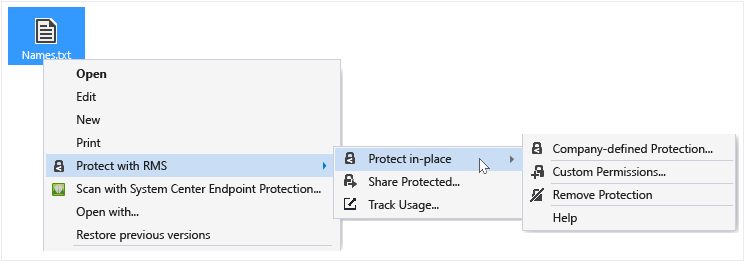

---
# required metadata

title: Protect a file on a device (protect in-place) by using the Rights Management sharing application | Azure RMS
description: When you protect a file in-place, it replaces the original, unprotected file. You can then leave the file where it is, copy it to another folder or device, or share the folder that it is in and the file will remain protected. You could also attach the protected file to an email message, although the recommended way to share a protected file by email is directly from File Explorer or an Office application.
author: cabailey
manager: mbaldwin
ms.date: 07/15/2016
ms.topic: article
ms.prod:
ms.service: rights-management
ms.technology: techgroup-identity
ms.assetid: 33920329-5247-4f6c-8651-6227afb4a1fa

# optional metadata

#ROBOTS:
#audience:
#ms.devlang:
ms.reviewer: esaggese
ms.suite: ems
#ms.tgt_pltfrm:
#ms.custom:

---

# Protect a file on a device (protect in-place) by using the Rights Management sharing application

>*Applies to: Active Directory Rights Management Services, Azure Rights Management, Windows 10, Windows 7 with SP1, Windows 8, Windows 8.1*

When you protect a file in-place, it replaces the original, unprotected file. You can then leave the file where it is, copy it to another folder or device, or share the folder that it is in and the file will remain protected. You could also attach the protected file to an email message, although the recommended way to share a protected file by email is directly from File Explorer or an Office application (see [Protect a file that you share by email by using the Rights Management sharing application](sharing-app-protect-by-email.md)).

> [!TIP]
> If you see any errors when you try to protect files, refer to [FAQ for Microsoft Rights Management Sharing Application for Windows](http://go.microsoft.com/fwlink/?LinkId=303971).

## To protect a file on a device (protect in-place)

1.  In File Explorer, select a file to protect. Right-click, select **Protect with RMS**, and then select **Protect in-place**. For example:

    

    > [!NOTE]
    > If you do not see the **Protect with RMS** option, it’s likely that either the RMS sharing application is not installed on your computer, or your computer must be restarted to complete the installation. For more information about how to install the RMS sharing application, see [Download and install the Rights Management sharing application](install-sharing-app.md).

2.  Do one of the following:

    -   Select a policy template: These are predefined permissions that typically restrict access and usage to people in your organization. For example, if your organization name is "Contoso, Ltd", you might see **Contoso, Ltd - Confidential View Only**. If this is the first time you have protected a file on this computer, you will first need to select **Company-defined Protection** to download the templates.

        The next time you click the **Protect in-place** option, you will see up to 10 templates to choose from. If there are more than 10 templates available and the one you want isn’t displayed, click **Company-defined Protection** to download and see all the templates.

        When you select a policy template, you can also protect multiple files and a folder. When you select a folder, all the files in that folder are automatically selected for protection but new files that you create in that folder will not be automatically protected.

    -   Select **Custom Permissions**: Choose this option if the templates don’t provide the level of protection that you need  or you want to explicitly set the protection options yourself. Specify the options that you want for this file in the [add protection dialog box](sharing-app-dialog-box.md), and then click **Apply**.

3.  You might quickly see a dialog box to tell you that the file is being protected, and the focus then returns to File Explorer. The selected file or files are now protected. In some cases (when adding protection changes the file name extension), the original file in File Explorer is replaced with a new file that has the Rights Management protection lock icon. For example:

    

If you change your mind about the permissions or later need to modify them, simply protect the file again.

If you later need to remove protection from a file, see [Remove protection from a file by using the Rights Management sharing application](sharing-app-remove-protection.md).

## Examples and other instructions
For examples for how you might use the Rights Management sharing application, and how-to instructions, see the following sections from the Rights Management sharing application user guide:

-   [Examples for using the RMS sharing application](sharing-app-user-guide.md#examples-for-using-the-rms-sharing-application)

-   [What do you want to do?](sharing-app-user-guide.md#what-do-you-want-to-do)

## See Also
[Rights Management sharing application user guide](sharing-app-user-guide.md)
