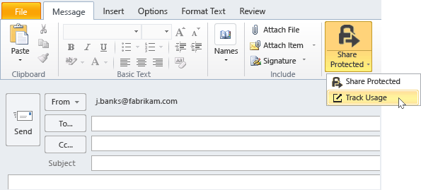

---
# required metadata

title: Track and revoke your documents when you use the RMS sharing application | Azure RMS
description:
keywords:
author: cabailey
manager: mbaldwin
ms.date: 06/19/2016
ms.topic: article
ms.prod: azure
ms.service: rights-management
ms.technology: techgroup-identity
ms.assetid: 61f349ce-bdd2-45c1-acc5-bc83937fb187

# optional metadata

#ROBOTS:
#audience:
#ms.devlang:
ms.reviewer: esaggese
ms.suite: ems
#ms.tgt_pltfrm:
#ms.custom:

---

# Track and revoke your documents when you use the RMS sharing application

*Applies to: Azure Rights Management, Windows 10, Windows 7 with SP1, Windows 8, Windows 8.1*

After you have protected your documents by using the RMS sharing application, if your organization is using Azure Rights Management rather than Active Directory Rights Management Services, you can track how people are using your protected documents. If necessary, you can also revoke access to these documents when you want to stop sharing them. To do this, you use the **document tracking site**, which you can access from Windows computers, Mac computers, and even from tablets and phones.

<iframe style="position: absolute;top: 0;left: 0;right: 0;bottom: 0;" width="100%" height="100%" src="https://channel9.msdn.com/Series/Information-Protection/Azure-RMS-Document-Tracking-and-Revocation/player" frameborder="0" allowfullscreen></iframe>

When you access this site, sign in to track your documents. Providing your organization has a [subscription that supports document tracking and revocation](https://technet.microsoft.com/dn858608.aspx) and you are assigned a license for this subscription, you can then see who tried to open the files that you protected and whether they were successful (they were successfully authenticated) or not. Each time they tried to access the document, and their location at the time. In addition:

-   If you need to stop sharing a document: Click **Revoke access**, note the period of time that the document will continue to be available, and decide whether to let people know that you’re revoking access to the document you previously shared, and provide a customized message. When you revoke a document, it doesn't delete the document that you shared but authorized users will no longer be able to open it.

-   If you want to export to Excel: Click **Export to CSV**, so that you can then modify the data, and create your own views and graphs.

-   If you want to configure email notifications: Click **Settings** and select how and whether to be emailed when the document is accessed.

- If you want to track and revoke shared documents for others: Administrators for Azure RMS can track and revoke documents for others by clicking the Admin icon. Only administrators see this icon.

-   If you have questions or want to provide feedback about the document tracking site: Click the Help icon to access the [FAQ for Document Tracking](http://go.microsoft.com/fwlink/?LinkId=523977).

## Using Office to access the document tracking site

-   For the Office applications, Word, Excel, and PowerPoint: On the **Home** tab, in the **RMS** group, click **Share Protected**, and then click **Track Usage**.

    

-   For Outlook: On the **Home** tab, in the  **RMS** group, click **Track Usage**:

    

If you do not see these options for RMS, it’s likely that either the RMS sharing application is not installed on your computer, the latest version isn’t installed, or your computer must be restarted to complete the installation. For more information about how to install the sharing application, see [Download and install the Rights Management sharing application](install-sharing-app.md).

### Other ways to track and revoke your documents
In addition to tracking your documents on Windows computers by using Office applications, you can also use these alternatives:

-   **Using a web browser**: This method works for all supported devices.

-   **Using File Explorer**: This method works for Windows computers.

-   **Using an Outlook email message**: This method works for Windows computers.

#### Using a web browser to access the doc tracking site

-   Using a supported browser, go to the [document tracking site](http://go.microsoft.com/fwlink/?LinkId=529562).

    Supported browsers: We recommend using Internet Explorer that is at least version 10, but you can use any of following browsers to use the document tracking site:

    -   Internet Explorer: At least version 10

    -   Internet Explorer 9 with at least MS12-037: Cumulative Security Update for Internet Explorer: June 12, 2012

    -   Mozilla Firefox: At least version 12

    -   Apple Safari 5: At least version 5

    -   Google Chrome: At least version 18

#### Using File Explorer to access the doc tracking site

-   Right-click the file, select **Protect with RMS**, and then select **Track Usage**:

    

#### Using an Outlook email message to access the doc tracking site

-   In an email message, in the **Message** tab, in the  **RMS** group, click **Share Protected**, and then click **Track Usage**:

    

## Examples and other instructions
For examples for how you might use the Rights Management sharing application, and how-to instructions, see the following sections from the Rights Management sharing application user guide:

-   [Examples for using the RMS sharing application](sharing-app-user-guide.md#examples-for-using-the-rms-sharing-application)

-   [What do you want to do?](sharing-app-user-guide.md#what-do-you-want-to-do-)

## See Also
[Rights Management sharing application user guide](sharing-app-user-guide.md)
