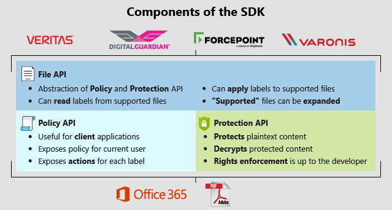

# Microsoft Information Protection SDK - API concepts

The MIP SDK is composed of three APIs, as shown in the following diagram:

Depending on your application's needs, you may be able to interface at the File API layer, or may need to work directly with the Policy and/or Protection API layer(s).

## File API

The File API is an abstraction of both the Protection and Policy APIs. It provides easy-to-use interfaces for reading labels from the service, applying labels to defined file types, as well as reading labels from those files types. The File API will be used by any service or application where a supported file type is involved and labels must be read or written, or content protected or decrypted.

### File API Use Cases

- You’re a software engineer at a financial services institution. You want to be sure that data from your LOB applications, typically exported in Excel format, are labeled on export based on the contents. File API can be used to list available labels then to apply the appropriate label to a supported file format.

- Your organization develops a cloud access security broker (CASB). Your customers ask for the ability to apply MIP labels to Microsoft Office and PDF documents. The File API would enable you to display a list of configured labels, then allow your customers to build rules which would apply the desired label. File API, taking in the label ID, would handle the rest for files meeting the customer’s criteria.

- Your organization provides a service-based data loss prevention solution and/or a CASB that monitors SaaS applications for file activity. To reduce the risk of data loss or exposure where data is protected with MIP, your service must be able to scan the contents of protected files. Using File API for the supported formats, when the service is a privileged user, you can remove protection, scan the contents for restricted or sensitive content, discard the plaintext result, and apply a service rule to report on or remediate the risk if found.

## Policy API

The Policy API, or Universal Policy Engine (UPE), provides the ability for software developers to obtain labeling policies for a specific user, then to "compute" the actions those labels should take.

The Policy API will be leveraged primarily by client applications where the develop controls the interface and file format, or where the only requirement is to obtain user policy and not necessarily to label files directly. 

### Policy API Use Cases

- Your organization develops 3D design software that uses a proprietary file format. Your customers use Microsoft Information Protection and want to be able to apply labels natively through your application. As the software engineer, you’d use the Policy API and a custom control to display the labels available for the authenticated user. Once the user selects a label, you’d call the compute action method of the API to know exactly what should be applied as far as metadata, content marking, and protection.

- Your organization develops a DLP service that allows your customers to configure DLP policies via a central administration portal. You have customers that use Microsoft Information Protection and would like to be able to read or apply AIP labels as part of DLP policies. As the software engineer, you can use the Policy API to get a list of labels for the customer organization, then read those labels as part of a DLP rule or apply the label information as part of a rule action.

## Protection API

The Protection API provides the ability for software developers to convert plaintext streams in to rights-managed streams and vice-versa.

### Protection API Use Cases

- Your organization develops 3d printing software using a propriety file format. You want to use MIP to protect the file, so it can be printed only by specific users. Using the Protection API, you can apply protection to the file so that only authorized consumers would be able to open, and/or print. 

- Your organization develops an eDiscovery solution that processes Exchange mailboxes and PST files. Your application must be able to user to decrypt messages to fully perform eDiscovery. Using a custom message/RPMSG parser and a sufficiently privileged account, you could leverage the RMS API to decrypt the encrypted file, scan the contents, and discard if out of scope or package if in scope.

## Next steps

Now that you have a general idea of the available MIP APIs and how they're used, continue with [Profile and Engine object concepts](concept-profile-engine-cpp.md). These concepts are fundamental, and apply to all MIP API sets.